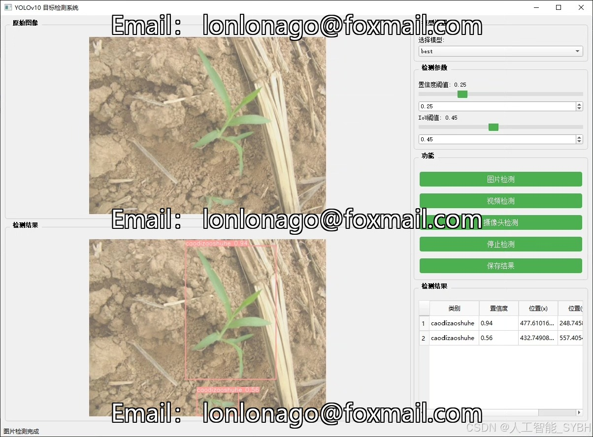
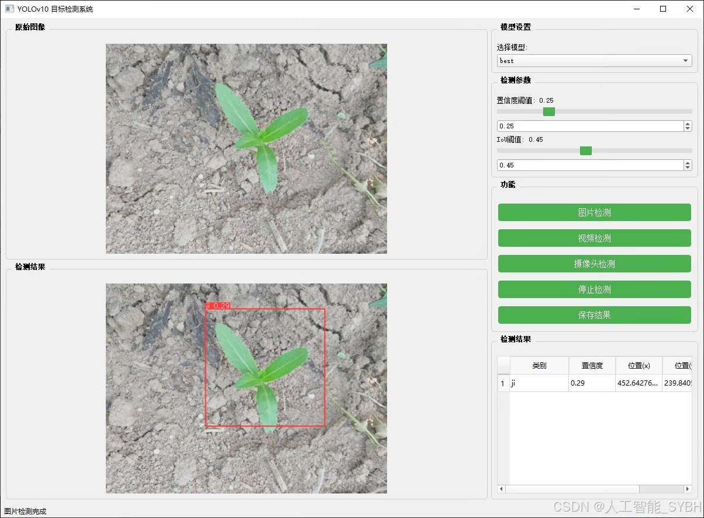
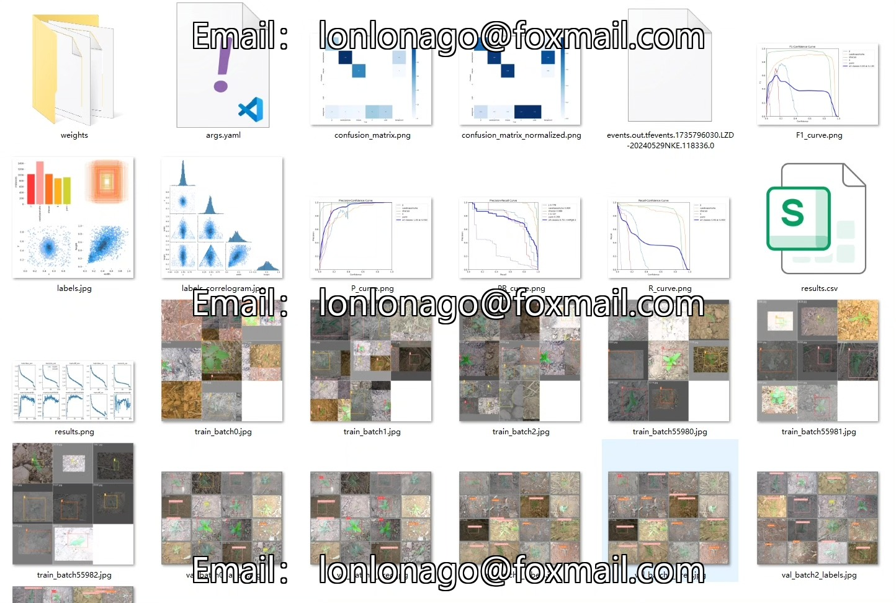
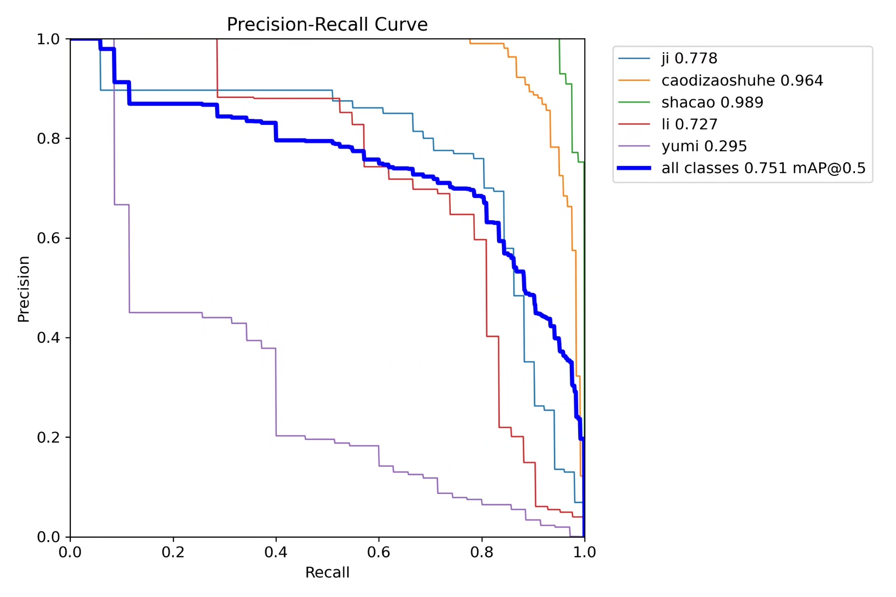
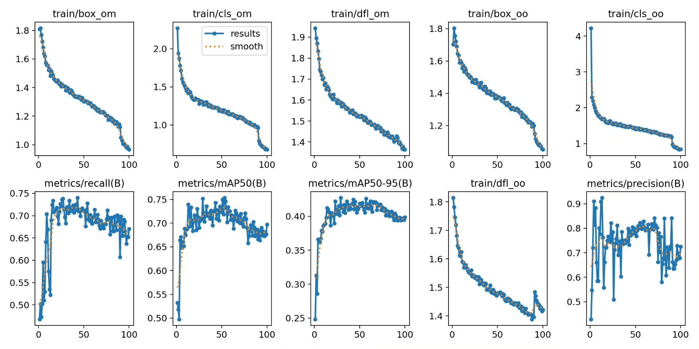
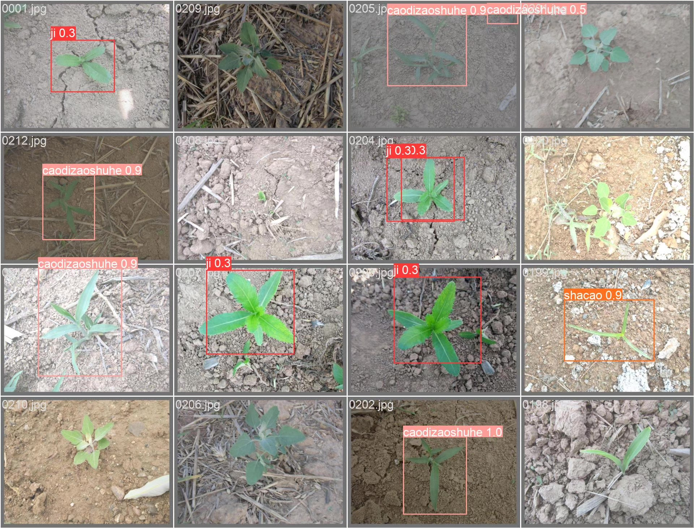
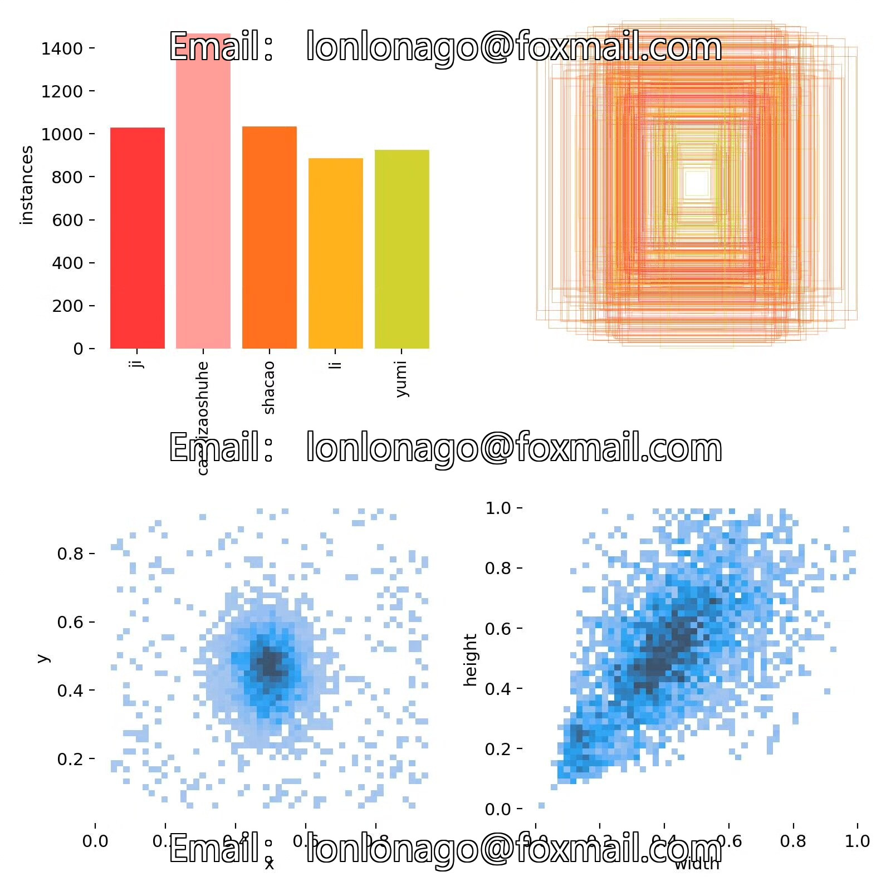
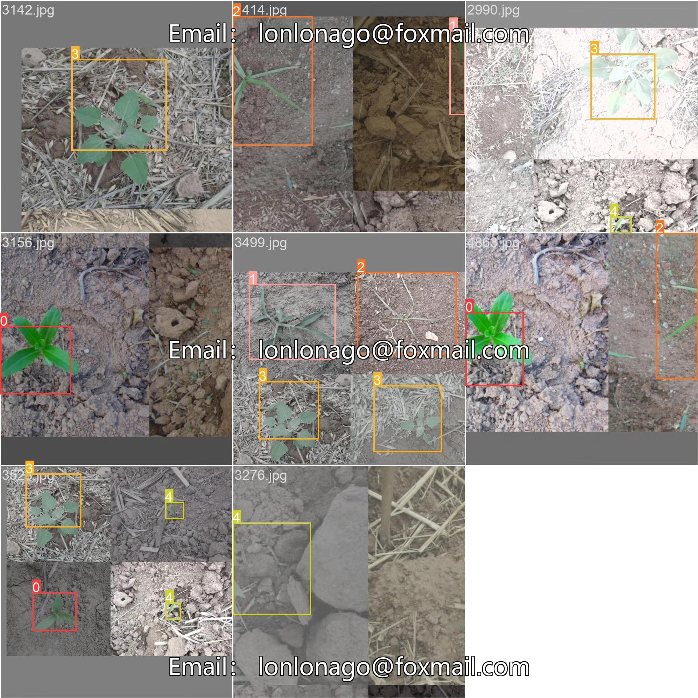

# Corn weed detection system based on deep learning YOLOv10

## Body

Based on the deep learning YOLOv10, a corn weed detection system (YOLOv10+YOLO dataset + UI interface + Python project source code + model)

In agricultural production, weeds are one of the important factors affecting crop growth and yield. Traditional methods of weed identification and removal rely on manual operations, which are inefficient and costly. With the rapid development of computer vision and deep learning technology, automatic weed detection systems based on images have gradually become a research hotspot. The purpose of this project is to utilize the YOLOv10 object detection algorithm to achieve automatic detection of five common weeds (ji, caodizaoshuhe, shacao, li, yumi), providing technical support for precision agriculture.

The company's products have obtained the official commercial license certification from YOLO.

We provide after-sales service.

After payment, we will provide WeChat ID for instant questions.

Environmental configuration: We will provide a tutorial on environmental configuration, and WeChat will provide answers to questions.

Remote installation service: If you need remote configuration, an additional fee of 69 is required, with all fees refunded if the configuration fails (only refund installation fees for older computers).

Retraining dataset: After setting up the environment, you can train on your own computer. If you need us to retrain, just pay 69 plus computing power fees (2.5 yuan/hour).

Full after-sales service

## Images

## Payment

Here is a pay link on Stripe ( https://buy.stripe.com/3cs8yP7sY87d0vu9AB ). Please contact me lonlonago@foxmail.com after funding $89, and I will send you a complete data files , thank you!

